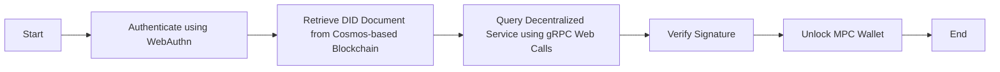

WebAuthn (Web Authentication) is a web standard that provides a secure and convenient way to authenticate users to web applications using public key cryptography. It allows users to log in to websites and applications without the need for passwords. WebAuthn supports various authentication methods, including passkeys, which are one of the simplest and most user-friendly options.

## **What are WebAuthn Passkeys?**

WebAuthn passkeys are a type of authentication method that allows users to authenticate themselves to web applications using a physical device, such as a security key or a biometric device (e.g., fingerprint reader). These passkeys are used as an alternative to traditional passwords, providing a more secure and user-friendly authentication experience.

## **How do WebAuthn Passkeys work?**

WebAuthn passkeys rely on public key cryptography to authenticate users. Here's a simplified explanation of how the process works:

1. Registration:
   - The user initiates the registration process on a web application that supports WebAuthn.
   - The web application generates a new key pair for the user.
   - The public key is stored by the web application, while the private key remains on the user's device.
   - The web application associates the user's public key with their account.
2. Authentication:
   - When the user wants to log in to the web application, they are prompted to provide their passkey (e.g., insert a security key or use a biometric device).
   - The web application sends a challenge to the user's device.
   - The user's device uses the private key associated with the web application to sign the challenge.
   - The signed challenge is sent back to the web application.
   - The web application verifies the signature using the stored public key associated with the user's account.
   - If the signature is valid, the user is authenticated and granted access to the web application.

## **Benefits of WebAuthn Passkeys**

WebAuthn passkeys offer several advantages over traditional password-based authentication:

1. Enhanced Security: Passkeys provide a higher level of security compared to passwords. Since the private key remains on the user's device, it is less susceptible to theft or unauthorized access. Additionally, the use of public key cryptography ensures that the authentication process is resistant to phishing attacks.
2. User-Friendly: Passkeys offer a more user-friendly authentication experience. Users can simply insert a security key or use a biometric device (e.g., fingerprint reader) to authenticate themselves, eliminating the need to remember and enter complex passwords.
3. Interoperability: WebAuthn passkeys are supported by major web browsers and platforms, making them widely compatible. This allows users to use the same passkey across multiple websites and applications, reducing the need for multiple passwords.

## **Resources**

- WebAuthn Specification: **https://www.w3.org/TR/webauthn/**
- WebAuthn Guide: **https://webauthn.guide/**
- WebAuthn on MDN Web Docs: **https://developer.mozilla.org/en-US/docs/Web/API/Web_Authentication_API**
