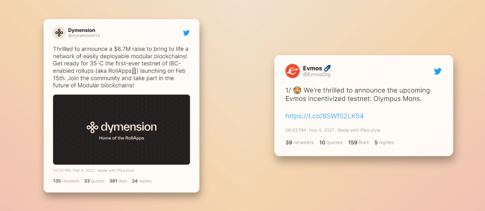

---
layout:
  title:
    visible: true
  description:
    visible: false
  tableOfContents:
    visible: true
  outline:
    visible: true
  pagination:
    visible: true
---

# 1. Identifying Potential Validators

Finding enough validators will likely **not be your core challenge** as nearly all Cosmos chains currently have a full active set. Validators understand the economic challenge in joining a mature set and are exceedingly interested in being part of your genesis set as it offers multiple benefits, including the potential for an early delegation and attracting stake from core and loyal community members.

## **Finding and Selecting Validators**

If you want to find suitable validators, it's helpful to first consider what your desired validator set should look like. This can guide your approach and make it easier to identify the most fitting validators.There **are various types of validators** available, which can primarily be classified based on their commitment to the business of proof-of-stake validation (please note that these subsegments are not sharply separated):

* **Professional Validators Enterprises:** These validators make running validators their primary business. They operate nodes on multiple chains and have a specialized team of experts to manage their infrastructure. They might also be interested in investing in your project.
* **Entity Validators (Centralize Exchanges, Funds, Protocols):** These validators primarily represent an entity not focused on validation as its core business. They choose to run a validator to earn economic rewards or to provide staking as a service to their customers. Often, the nodes are managed by a third-party (known as white-label validators).
* **Community Validators:** Validators that community members run. There is a wide variety of community validators, such as tech-savvy developers, DAO unions, content creators, and other entities.

All three types of validators described above will likely be included in your validator set. Professional validators can ensure a high network quality, provide access to experienced experts or even become investors and self-stake their allocation. Entity validators may promote collaboration with other ecosystems if run by different project teams (for example, Injective or Prism). However, please be aware that these validators may be run by the same entity in the background, also known as Validator-as-a-Service, and may not align with your decentralization goals.Ultimately, a healthy ecosystem requires many community validators who share the ecosystem's goals and allows them to generate additional income. Therefore, consider defining a number for each category in your initial validator set. T[o](http://set.to) **identify the most suitable validators**, you can define specific **validator metrics** to evaluate your potential validator candidates. Here are some ideas for metrics that can be used to create a validator framework:

### **Technical Capability:**

* **Experience Level:** How long has the validator been running nodes? On how many chains is the validator running? Do they have a proven track-record?
* **Upgrade Discipline:** Does the validator upgrade their software on time without missing too many blocks?
* **Monitoring:** Does the validator have a monitoring system in place?
* **Infrastructure Backup:** How does the validator organize backup solutions? How does the validator organize key management?

### **Contributions Effort:**

* **Community Leadership:** Is the validator a known entity within the community?
* **Community contributions:** Does the validators engage in the community, create and distribute educational content?
* **Technical contributions:** Does the validator run different types of nodes, relayers, create tools, block explorers and other smart contract contributions for the blockchain?

### **Decentralization Effort:**

* **Geographic Diversity:** Does the validator run their infrastructure in a country that contributes to a higher geographical decentralization of the set?
* **Infrastructure Provider Diversity:** Does the validator run their infrastructure on local hardware or do they rely on cloud providers?

### **Accountability Effort:**

* **Governance Participation:** Does the validator engage actively in governance discussions and vote on every proposal?
* **Financial Firepower:** Can the validator ensure to run their infrastructure during an extended bear market?
* **Identity & Credentials:** What country is the validator’s legal entity incorporated in? Do they have a website where they advertise their operations as they see fit as well as a communication channel? Can the validator verify themselves?
* **Validator Commission:** How much commission does the validator take and how fast can they increase it? Did they ever change commission?

Once you have identified the core metrics for your validators, there are two ways to get in touch with them: **active or passive outreach**.

It can be hard and time consuming to get some of the above metrics for each validator based on public information alone. You may want to create a form for validators to fill out to receive the best insights based on the validator metrics you have chosen, and share it on platforms such as Twitter, Medium, your blog, and your Discord server. As mentioned previously, validators will seek opportunities to validate on your network. Therefore, you will likely receive more requests than spots available.

<figure><figcaption></figcaption></figure>

## **Providing Resources**

Your validators will require some general documentation to get started with the infrastructure. While experienced validators may be familiar with the process for Cosmos chains, they will still need specific guidance on running a node, interacting with the command-line interface (CLI), and connecting to your testnets and/or mainnet. Some typical information requirements may include the following:

* Hardware/Server Requirements
* Daemon/Command-Line-Interface (CLI)
* Genesis File
* Seed & Peers information
* Gas & Fees Information
* Key Management
* Alerting and Monitoring tools
* DDos Protection
* Faucet or Token Markets
* FAQs

Simple documentation within the existing "docs" infrastructure of your project has been proven to be the most effective form of presentation. It is recommended to have a specific Github repository containing all necessary information as an official backup for more user-friendly documentation efforts on the official docs page. Some examples of successful validator docs can be found below:

* [**Cosmos Hub Docs**](https://hub.cosmos.network/main/hub-tutorials/join-mainnet.html)
* [**Juno Docs**](https://docs.junonetwork.io/validators/joining-mainnet)
* [**Osmosis Docs**](https://docs.osmosis.zone/overview/validate/validating-mainnet)
* [**Injective Docs**](https://docs.injective.network/nodes/Validators/becoming-a-validator)
* [**Mars Docs**](https://docs.marsprotocol.io/docs/validate/validators/overview)
* [**Sei Github Docs**](https://github.com/sei-protocol/testnet)
